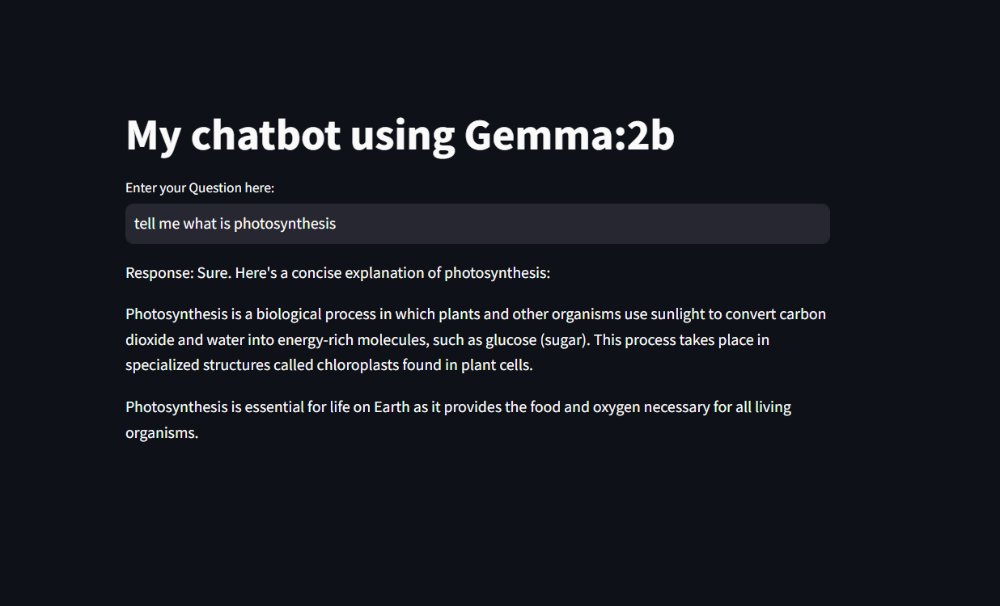

<!DOCTYPE html>
<html lang="en">
<head>
  <meta charset="UTF-8">

</head>
<body>

  <h1>🤖 DeepSeek-R1 Chatbot with Ollama, Streamlit, and LangChain</h1>

  

    This project showcases a locally running AI chatbot powered by the <strong>DeepSeek-R1</strong> language model, integrated using <strong>Ollama</strong> for model management, <strong>Streamlit</strong> for the user interface, and <strong>LangChain</strong> for orchestrating the language model interactions. The chatbot provides a seamless and interactive experience for users to engage with the AI model directly from their browser.
  

  

  <h2>🚀 Features</h2>
  <ul>
    <li>Runs the DeepSeek-R1 model locally using Ollama</li>
    <li>Interactive web interface built with Streamlit</li>
    <li>Language model orchestration handled by LangChain</li>
    <li>Quick and easy setup with minimal configuration</li>
    <li>All data processing occurs locally, ensuring privacy</li>
  </ul>

  

  <h2>🛠️ Installation</h2>
  
Follow these steps to set up and run the chatbot on your local machine:

  <ol>
    <li>Clone the repository:
      <pre><code>git clone https://github.com/kunalmahadule/Project-1-DeepSeek-R1-Bot-using-Ollama.git</code></pre>
    </li>
    <li>Navigate to the project directory:
      <pre><code>cd Project-1-DeepSeek-R1-Bot-using-Ollama</code></pre>
    </li>
    <li>Install the required Python packages:
      <pre><code>pip install -r requirements.txt</code></pre>
    </li>
    <li>Ensure Ollama is installed and running on your system. If not, install it from the official website.</li>
    <li>Run the Streamlit application:
      <pre><code>streamlit run app.py</code></pre>
    </li>
  </ol>

  

  <h2>📂 Project Structure</h2>
  <ul>
    <li><code>app.py</code> – Main application script for the Streamlit interface</li>
    <li><code>info.txt</code> – Additional information and instructions</li>
    <li><code>output.png</code> – Sample output image from the chatbot</li>
    <li><code>requirements.txt</code> – List of required Python packages</li>
    <li><code>README.md</code> – Project documentation</li>
  </ul>

  

  <h2>📸 Sample Output</h2>
  
Below is a sample output image generated by the chatbot:

  

  

  <h2>📌 Usage</h2>
  
After running the application, a new browser window will open displaying the chatbot interface. Enter your queries in the input box, and the chatbot will respond using the DeepSeek-R1 model.

  

  <h2>👤 Author</h2>
  
Developed by <strong>Kunal Mahadule</strong>

  
GitHub: <a href="https://github.com/kunalmahadule" target="_blank">https://github.com/kunalmahadule</a>

  

  
⭐ If you find this project useful, please consider starring the repository!

</body>
</html>
